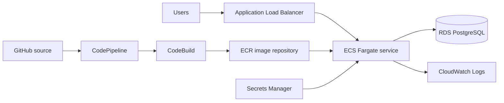

# Terraform AWS ECS Fargate Platform

[](https://developer.hashicorp.com/terraform)
[](https://registry.terraform.io/providers/hashicorp/aws/latest/docs)

A Terraform reference platform for deploying a containerized web service on
Amazon ECS Fargate. It assembles the networking, runtime, database,
observability, image registry, and delivery resources needed to demonstrate a
complete application path on AWS.

Part of [Abel Nutsugah’s AWS infrastructure portfolio](https://github.com/bigmanabel).

## Use case

Start here when a team needs a documented baseline for running a containerized
application behind a load balancer, with application tasks and PostgreSQL in
private subnets. The repository is especially useful for discussing the
trade-offs between a demo-friendly platform and a production-ready one.

## Architecture



## What Terraform creates

- A VPC with public load-balancer subnets and private application/database
  subnets across two Availability Zones
- An Application Load Balancer, target group, ECS cluster, Fargate service,
  task definition, and CloudWatch log group
- PostgreSQL RDS instance, database subnet group, security groups, and a
  Secrets Manager entry for database credentials
- ECR, CodeBuild, CodePipeline, CodeStar Connection, and S3 artifact storage
- IAM roles and policies required by the ECS tasks and delivery pipeline

## Prerequisites

- Terraform `~> 1.7` and AWS CLI authentication
- An AWS account with permissions to create the listed resources
- A GitHub repository containing a Dockerfile and `buildspec.yml` for the
  application that CodePipeline will build
- A distinct project name—resource names are derived from it

## Configure and validate

Copy the example file and keep secrets out of version control:

```bash
cp terraform.tfvars.example terraform.tfvars
terraform fmt -check -recursive
terraform init
terraform validate
terraform plan
```

Example non-secret inputs:

```hcl
aws_region   = "us-east-1"
project_name = "example-ecs-platform"
image_url    = "public.ecr.aws/docker/library/nginx:stable"
vpc_cidr     = "10.0.0.0/16"
github_owner = "your-github-user-or-org"
github_repo  = "your-application-repository"
github_branch = "main"
```

Review the plan before applying:

```bash
terraform apply
```

## Connect the delivery pipeline

After the first apply, open **AWS Console → Developer Tools → Connections** and
complete the pending CodeStar connection to GitHub. Then push a change to the
configured source branch. The pipeline follows this path:

```text
GitHub source → CodePipeline → CodeBuild → ECR → ECS service deployment
```

The application repository must publish an `imagedefinitions.json` artifact.
The included CodeBuild configuration passes `REPOSITORY_URI`, `IMAGE_TAG`, and
`AWS_DEFAULT_REGION` to the build process. `IMAGE_TAG` is the source commit ID,
so every pipeline build creates an immutable, traceable ECR image tag.

## Operational and security notes

- ECS tasks and RDS are placed in private subnets; the ALB is the public entry
  point. Security groups limit traffic by role.
- RDS generates the database password and stores it in Secrets Manager. Use a
  protected remote state backend and restrict access to the RDS-managed secret.
- AWS resources created here—including NAT gateways, RDS, ALB, CodeBuild, and
  CodePipeline—incur charges. Review your plan and AWS pricing before apply.
- Logs use a seven-day retention period. Tune retention and alarms to match the
  environment’s operational requirements.

## Demo defaults vs. production follow-ups

This is a portfolio reference implementation, not a claim of production
readiness. The current defaults are intentionally simple and should be reviewed
before a client deployment:

| Current choice | Recommended production review |
| --- | --- |
| Single-AZ RDS with `skip_final_snapshot = true` | Multi-AZ availability, backup retention, deletion protection, and a final-snapshot policy |
| Mutable ECR tags with `force_delete = true` | Immutable release tags, lifecycle controls, and retention requirements |
| RDS-managed master credentials | A rotation schedule and access review for the generated secret |
| Baseline CloudWatch logging | Alarms, dashboards, tracing, and incident ownership |

## Project layout

```text
├── main.tf                       # Composes network and ECS modules
├── data.tf                       # AWS account, region, and availability-zone data
├── terraform.tfvars.example      # Safe input template
└── modules/
    ├── vpc/                      # VPC, subnets, routing, and security groups
    └── ecs-fargate/              # ALB, ECS, RDS, ECR, pipeline, IAM, and logs
```

## Cleanup

Run `terraform destroy` only after confirming the target account and workspace.
It removes the application platform and may remove container images and
pipeline artifacts according to the current configuration.
